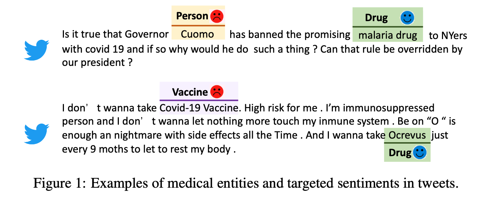
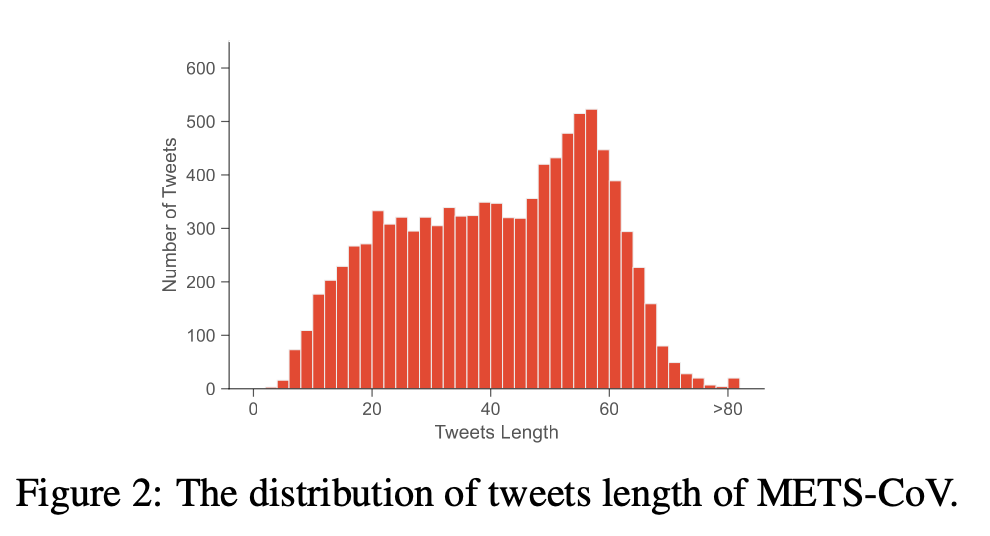
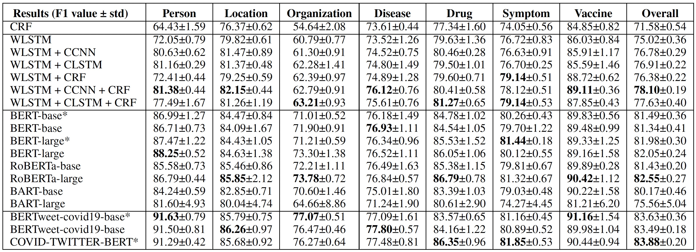
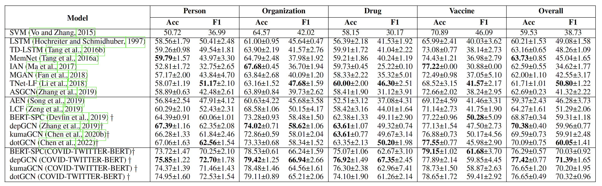

# METS-CoV: A Dataset of Medical Entity and Targeted Sentiment on COVID-19 Related Tweets

This repository includes the dataset and benchmark of the paper:

**METS-CoV: A Dataset of Medical Entity and Targeted Sentiment on COVID-19 Related Tweets (Submitted to NeurIPS 2022 Track on Datasets and Benchmarks).**

**Authors**: Peilin Zhou, Zeqiang Wang, Dading Chong, Zhijiang Guo, Yining Hua, Zichang Su, Zhiyang Teng, Jiageng Wu, Jie Yang


## Abstract
The COVID-19 pandemic continues to bring up various topics discussed or debated on social media. 
In order to explore the impact of pandemics on people's lives, it is crucial to understand the public's concerns and attitudes towards pandemic-related entities (e.g., drugs, vaccines) on social media. 
However, models trained on existing named entity recognition (NER) or targeted sentiment analysis (TSA) datasets have limited ability to understand COVID-19-related social media texts because these datasets are not designed or annotated from a medical perspective. 
In this paper, we release METS-CoV, a dataset containing medical entities and targeted sentiments from COVID-19 related tweets. 
METS-CoV contains 10,000 tweets with 7 types of entities, including 4 medical entity types (_Disease_, _Drug_, _Symptom_, and _Vaccine_) and 3 general entity types (_Person_, _Location_, and _Organization_). 
To further investigate tweet users' attitudes toward specific entities, 4 types of entities (_Person_, _Organization_, _Drug_, and _Vaccine_) are selected and annotated with user sentiments, resulting in a targeted sentiment dataset with 9,101 entities (in 5,278 tweets). 
To the best of our knowledge, METS-CoV is the first dataset to collect medical entities and corresponding sentiments of COVID-19 related tweets. 
We benchmark the performance of classical machine learning models and state-of-the-art deep learning models on NER and TSA tasks with extensive experiments. 
Results show that this dataset has vast room for improvement for both NER and TSA tasks. 
With rich annotations and comprehensive benchmark results, we believe METS-CoV is a fundamental resource for building better medical social media understanding tools and facilitating computational social science research, especially on epidemiological topics. 
Our data, annotation guidelines, benchmark models, and source code are publicly available [link](https://github.com/YLab-Open/METS-CoV) to ensure reproducibility.



## Dataset

We collect COVID-19 related tweets ranging from February 1, 2020, to September 30, 2021.
We define 7 entity types based on public health research needs, including 3 general entity types and 4 medical entity types for annotation. 
In particular, we select 4 entity types for additional sentiment annotation with 3 types of sentiment labels: positive, negative, and neutral. 
All the annotation work is done using the [YEDDA](https://github.com/jiesutd/YEDDA) annotation platform.

### Data Statistics
The figure below shows the distribution of tweet lengths in METS-CoV.
Most tweets have lengths between 20 and 60 tokens (split with white spaces). 




### Data Access
Following Twitter's automation rules and data security policy, we can not directly provide the original tweets to dataset consumer. 
Therefore, the Tweet IDs and corresponding annotations are released to the public. 
Based on the Tweet IDs provided by us, the dataset consumers could download the original tweets freely via official Twitter API by themselves.

Here we also provide the script `download_tweets.py` to help users to download tweets using Tweet IDs. (Before downloading, users need to apply for a Twitter developer account first.)

We perform a train-dev-test splitting of our dataset with a ratio of 70:15:15.

Training, validation and test data are available in `dataset` folder, which are saved in a CSV format.

| tweet_id            | labels                                                                                                                                                                                                                                                                                                                           |
|---------------------|----------------------------------------------------------------------------------------------------------------------------------------------------------------------------------------------------------------------------------------------------------------------------------------------------------------------------------|
| 1423080345067565057 |  "[{'type': 'Organization', 'start_index': 5, 'end_index': 6, 'value': 'NextDoor', 'sentiment': 'Negative'}, {'type': 'Drug', 'start_index': 13, 'end_index': 15, 'value': 'MLM vitamin', 'sentiment': 'Negative'}]"
| 1278592113878409216 |  "[{'type': 'Disease', 'start_index': 3, 'end_index': 5, 'value': 'sleep apnea', 'sentiment': 'null'}]"

### Annotation Guidelines

Our annotation guidelines are customized to understand medical-related entities and sentiments better. NER guidelines include rules such as "when the manufacturer name refers to a vaccine in the tweet context, the name should be annotated as a vaccine rather than an organization". Sentiment guidelines include rules such as "when irony appears in an annotation entity, its sentiment should be annotated from the standpoint of the person who posted the tweet". 
More details can be found in our guidelines (see `annotation guidelines/`).  Both Chinese version and English version are released.


## Model Benchmarking 

### Preprocessing
After downloading the tweets, users need to preprocess the original tweets using following script:
```console
❱❱❱ python preprocess.py --input_path=xxx.csv --output_path=xxx.csv
```
* --input_path: the path of input csv file, the column name of the tweets should be 'full_text'.
* --output_path: the path to save preprocessed csv file

### NER
To reproduce the results of CRF model, users could use the [sklearn-crfsuite](https://sklearn-crfsuite.readthedocs.io/en/latest/).

All the experiments of NN-based and PLM-based NER models are conducted using [NCRF++]().
The config files of all these models are available in `NCRFpp_configs/` folder.

Users could check the documentation of NCRF++ to learn how to use these configs to reproduce the  benchmark results.

The link to the pretrained GloVe vectors is here:
* **[`GloVe: Global Vectors for Word Representation`](https://github.com/stanfordnlp/GloVe)**

The links to the PLM models are here:

* **[`bert-base-uncased`](https://huggingface.co/bert-base-uncased)**
* **[`bert-base-cased`](https://huggingface.co/bert-base-cased)**
* **[`bert-large-uncased`](https://huggingface.co/bert-large-uncased)**
* **[`bert-large-cased`](https://huggingface.co/bert-large-cased)**
* **[`RoBERTa-base`](https://huggingface.co/roberta-base)**
* **[`RoBERTa-large`](https://huggingface.co/roberta-large)**
* **[`BART-base`](https://huggingface.co/facebook/bart-base)**
* **[`BART-large`](https://huggingface.co/facebook/bart-large)**
* **[`BERTweet-covid19-base-uncased`](https://huggingface.co/vinai/bertweet-covid19-base-uncased)**
* **[`BERTweet-covid19-base-cased`](https://huggingface.co/vinai/bertweet-covid19-base-cased)**
* **[`COVID-TWITTER-BERT`](https://huggingface.co/digitalepidemiologylab/covid-twitter-bert-v2)**

#### Leaderboard
We reported the results, namely mean ± std, based on experiments on 5 different random seeds: 22, 32, 42, 52 and 62. Mean is calculated by averaging the performances of different seeds. Std denotes the standard error, which is calculated by dividing the standard deviation of the mean value by the square root of the number of seeds.

Note: * means uncased model.

### TSA

To reproduce the results of LSTM, TD-LSTM, MemNet, IAN, MGAN, TNET-LF, ASGCN, AEN and LCF,  users could use [ABSA-PyTorch](https://github.com/songyouwei/ABSA-PyTorch).

To reproduce the results of BERT-SPC, depGCN, kumaGCN and dotGCN, please use the code of [pro-absa](https://github.com/zeeeyang/pro-absa).


#### Leaderboard
We reported the results, namely mean ± std, based on experiments on 5 different random seeds: 22, 32, 42, 52 and 62. Mean is calculated by averaging the performances of different seeds. Std denotes the standard error, which is calculated by dividing the standard deviation of the mean value by the square root of the number of seeds.

## Contact

If you have any questions about our dataset or benchmark results, please feel free to contact us!
(Peilin Zhou, zhoupalin@gmail.com; Jie Yang, jieynlp@gmail.com)
